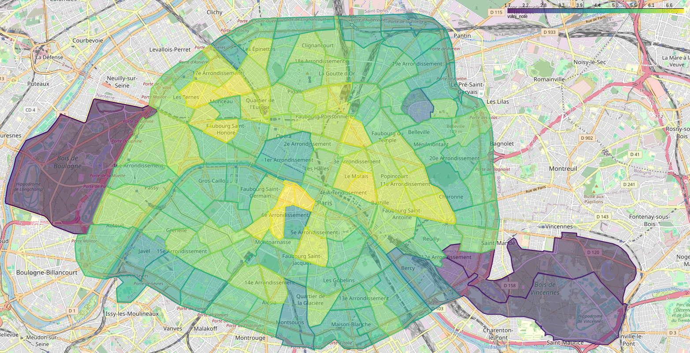

# climate-risks-paris
This repository contains the code and data for my RAship work in the Parisian climate risk project.

## Index
- [Heatstress](#heatstress)
- [Rent Control](#rent-control)

## Heatstress
The objective of this section is being able to tell how vulnerable a housing unit in Paris (or Île-de-France) is to heat and heat waves. This is done by calculating the average vulnerability at the _Code Postal_ (for Île-de-France) and at the _Conseil de Quartier_ (city of Paris) levels.

### Data Sources
- The data containing heatstress values can be found at the webpage from [L'Insitut Paris Region](https://data-iau-idf.opendata.arcgis.com/datasets/iau-idf::ilots-de-chaleur-urbains-icu-classification-des-imu-en-zone-climatique-locale-lcz-al%C3%A9as-et-vuln%C3%A9rabilit%C3%A9s-%C3%A0-la-chaleur-de-jour-et-de-nuit-en-%C3%AEle-de-france/about). The heatstress metrics are given at the _IMU_ (Ilot mMrphologic Urbain) level (can be visualized [here](https://data-iau-idf.opendata.arcgis.com/datasets/iau-idf::ilots-de-chaleur-urbains-icu-classification-des-imu-en-zone-climatique-locale-lcz-al%C3%A9as-et-vuln%C3%A9rabilit%C3%A9s-%C3%A0-la-chaleur-de-jour-et-de-nuit-en-%C3%AEle-de-france/explore), which roughly corresponds to a polygon the size of a building or group of buildings.
- The polygons for the _Conseils de Quartier_ can be found at [data.gouv.fr](https://www.data.gouv.fr/fr/datasets/les-conseils-de-quartier-par-arrondissement-prs/).
- The polygons for the _IRIS_ (Ilots Regroupés pour l'Information Statistique) are retrieved from the [géoservices webpage](https://geoservices.ign.fr/irisge)
- The crosswalk between _IRIS_ and _Commune_ is from the [INSEE webpage](https://www.insee.fr/fr/information/7708995#).
- Finally, the crosswalk between _Commune_ and _Code Postal_ can be found directly at [La Poste](https://datanova.laposte.fr/datasets/laposte-hexasmal).

### Code
Each _.py_ file does one thing, and is named accordingly. If you have doubts about how something was done, which is not explained here, you can read the code: I tried to add helpful comments.
- _fetch_heatstress_data.py_: Downloads all of the datasets mentioned in the [Data Sources](#data-sources) Section above.
- _conseils_de_quartier_heatstress.py_: Calculates the average heatstress at a _Conseil de Quartier_ level. Generates _conseils_de_quartier_heatstress.csv_
- _code_postal_heatstress.py_: Calculates the average heatstress at a _Code Postal_ level. Generates  _code_postal_heatstress.csv_

### Spatial Merges
#### _IMU_ - _Conseil de Quartier_
Relatively simple, since we have the polygons of both of them. Simply calculate, for each _Conseil de Quartier_, with how many _IMUs_ there is overlap, and do the average (see the [Averaging](#averaging) Section).

#### _IMU_ - _Code Postal_
Quite challenging, since there not seems to exist any repository with the polygon areas of the _Codes Postaux_ (see [this post](https://www.r-bloggers.com/2024/11/codes-postaux/) and [this article](https://vivreparis.fr/pourquoi-le-16e-arrondissement-possede-t-il-deux-codes-postaux/) for some insights). What we do, as a best-possible approach, is to try to map _Communes_ to _Codes Postaux_, stemming from the realization that in most cases, either they map one-to-one, or a _Code Postal_ encompasses __exactly__ many _Communes_. To generate the polygons at the _Commune_, we start from the _IRIS_ polygons, and just melt together the polygons at the _Commune_ level. This is possible because _IRIS_ are an exact subdivision of _Communes_. Now comes the crucial step: 
- If there is a one-to-one mapping between _Commune_ and _Code Postal_, the polygon of the _Code Postal_ is set to be the one of the _Commune_.
- If a _Code Postal_ contains __exactly__ multiple _Communes_, the polygon of the _Code Postal_ is the result of melting together the polygons of the _Communes_.
- If a _Commune_ contains __exactly__ multiple _Codes Postaux_ (happens in around 8 cases), all of the _Codes Postaux_ get assigned the polygon of the _Commune_.
- Finally, some _Codes Postaux_ contain multiple _Communes_ (happens in 3 cases), which in turn contain multiple _Codes Postaux_. Here, the polygon of the _Code Postal_ will be the melted union of the polygons of the _Communes_ where the _Code Postal_ is present. For instance: the _Code Posal_ 95710 corresponds to the _Communes_ 95101, 95150, and 95011, but inside the _Commune_ 95011 there are two _Codes Postaux_: 95710 and 95420. In that case, the _Code Postal_ 95710 gets assigned the melted polygons of 95101, 95150, and 95011; and the _Code Postal_ 95420 gets assigned the polygon of 95011. As a result, the polygons of both _Codes Postaux_ will partly overlap.

We obtain as a result a reasonable polygon for each _Code Postal_. Lastly, we calculate the average (see the [Averaging](#averaging) Section) of the heatstress variables.

### Averaging
Given a set of _IMUs_ $IMU_1, IMU_2, ..., IMU_N$ with corresponding heatstress values $x_1, x_2, ..., x_N$, the weighted average of $x$ for a polygon $P$ is defined as\
  $$\hat{x} = \frac{\sum_{i=1}^{N}|IMU_i \cap P|x_i}{\sum_{i=1}^{N}|IMU_i \cap P|}$$\
In words, the weight given to $x_i$ is proportional to the area of the intersection between $IMU_i$ and the polygon $P$.

### Variables
The interpretation of the heatstress variables can be found [here](https://www.institutparisregion.fr/fileadmin/DataStorage/IauEtVous/CartesEtDonnees/cartesetdonnees/opendata/MetaPDF/ICU_LCZ_Alea_Vuln_Champs_2022.pdf). We mainly use the following two:
- _vulnJ_note_: The vulnerability index to UHI during the day. Ranges from 1 (very low vulnerability) to 8 (very high vulnerability). Individual _IMUs_ have an integer value, the average is a real value.
- _vulnN_note_: Idem, but during the night.

### Results
The resulting files are _conseils_de_quartier_heatstress.csv_ and _code_postal_heatstress.csv_. A quick visualization shows that central areas in Paris have a higher vulnerability than the periphery; and that the vulnerability is reduced by the presence of parks and green areas.

## Rent Control
The objective of this section is matching the rent control data published by the [DRIHL](http://www.referenceloyer.drihl.ile-de-france.developpement-durable.gouv.fr/paris/) with the spatial units used by SeLoger:  _Code Postal_ and _Conseil de Quartier_.

### Data Sources
- The datasets containing the rent control data and polygons are directly extracted from the [DRIHL webpage](http://www.referenceloyer.drihl.ile-de-france.developpement-durable.gouv.fr/paris/). An inspection of the webpage reveals that the polygons and data are fetched by API calls that request _.kml_ files from the same website. For the rest of the exercise filter for the most recent rent control limits, in place from 2024-07-01 to 2025-06-30, and keep only data for Paris city.
- The polygons for the _Conseils de Quartier_ can be found at [data.gouv.fr](https://www.data.gouv.fr/fr/datasets/les-conseils-de-quartier-par-arrondissement-prs/).
- The polygons for the _Code Postal_ are taken from the [Heatstress](#heatstress) Section.

### Code
Each _.py_ file does one thing, and is named accordingly. If you have doubts about how something was done, which is not explained here, you can read the code: I tried to add helpful comments.
- _fetch_rent_control_data.py_: Downloads all of the datasets mentioned in the [Data Sources](#data-sources-1) Section above.
- _conseils_de_quartier_rent_control.py_: Calculates the average rent control prices at a _Conseil de Quartier_ level. Generates _conseils_de_quartier_rent_control.csv_, as well as _conseils_de_quartier_zone_overlap.csv_
- _code_postal_rent_control.py_: Calculates the average rent control prices at a _Code Postal_ level. Generates  _code_postal_rent_control.csv_, as well as _code_postal_zone_overlap.csv_

### Spatial Merges
The rent control area units are the 80 _Quartiers Administratifs_ (see the [official map](https://opendata.paris.fr/explore/dataset/quartier_paris/map/?disjunctive.c_ar&sort=c_qu&location=12,48.88786,2.35176&basemap=jawg.streets) from the Paris City Council), a subdivision of _Grand Quartiers_. The _Quartiers Administratifs_ are joined in 14 _Zones_ that share the same rent control levels. _Quartiers Administratifs_ in a same _Zone_ are not necessarily contiguous. 

#### _Zone_ - _Conseil de Quartier_
For around 70% of the 114 _Conseils de Quartier_, 90% of the area of the _Conseil de Quartier_ is inside a single _Zone_. For all but one, more than 50% of its area is inside a single _Zone_. The merge is relatively simple, since we have the polygons of both of them. Simply calculate, for each _Conseil de Quartier_, with how many _Zones_ there is overlap, and do the average (see the [Averaging](#averaging-1) Section).

#### _Zone_ - _Code Postal_
Out of the 21 _Codes Postaux_ of Paris, only 2 have more than 90% of their area inside a single _Zone_, so the match quality is lower than with _Conseils de Quartier_. Similarly, we calculate overlaps and average.

NOTE: This analysis could be expanded to Plaine Commune and Est Ensemble, since we have both the rent control and the postal code data for them, too.

### Averaging
Given a set of _Zones_ $Zone_1, Zone_2, ..., Zone_N$ with corresponding rent control values $x_1, x_2, ..., x_N$, the weighted average of $x$ for a polygon $P$ is defined as\
  $$\hat{x} = \frac{\sum_{i=1}^{N}|Zone_i \cap P|x_i}{\sum_{i=1}^{N}|Zone_i \cap P|}$$\
In words, the weight given to $x_i$ is proportional to the area of the intersection between $Zone_i$ and the polygon $P$.

### Variables
The datasets _*_rent_control.csv_ have 4 categorical variables and 3 numeric variables.

The categorical variables are:
- _cp_ or _cq_: _Code Postal_ or _Conseil de Quartier_;
- _rooms_: number of rooms of the property: 1, 2, 3, or 4. 4 corresponds to 4 or more;
- _epoque_: property construction epoque. Values are inf1946 (before 1946), 1946-1970, 1971-1990, sup1990 (after 1990);
- _furnished_: meuble or non-meuble.

The numeric variables, all of them expressed as €/m², are:
- _ref_: benchmark rent, as calculated by the _Observatoire des loyers de l'agglomération parisienne_ (OLAP).
- _refmaj_: higher benchmark rent (20% over the benchmark rent). Renting a property with a higher price is punishable by law.
- _refmin_: lower benchmark rent (30% under the benchmark rent).

### Results
The resulting files are _conseils_de_quartier_rent_control.csv_ and _code_postal_rent_control.csv_. Additionally, the files _conseils_de_quartier_zone_overlap.csv_ and _code_postal_zone_overlap.csv_ show the % of area of each unit inside the _Zone_ with highest overlap.

A quick visualization shows that central areas in Paris have a higher reference rent than the periphery.
