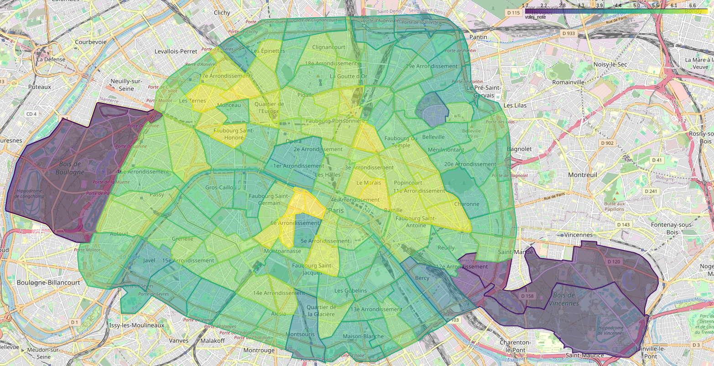
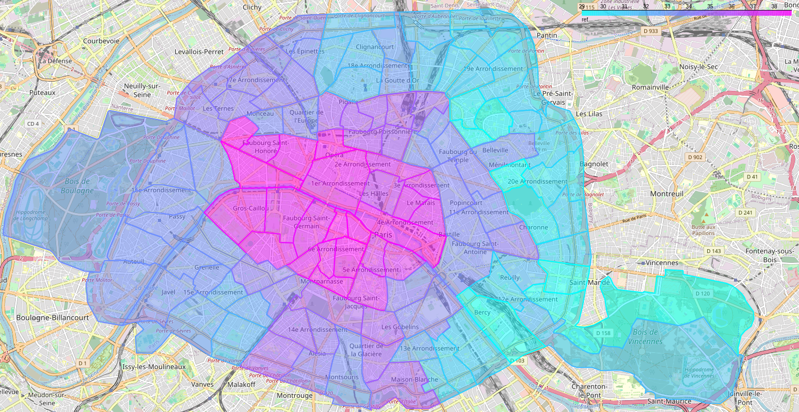
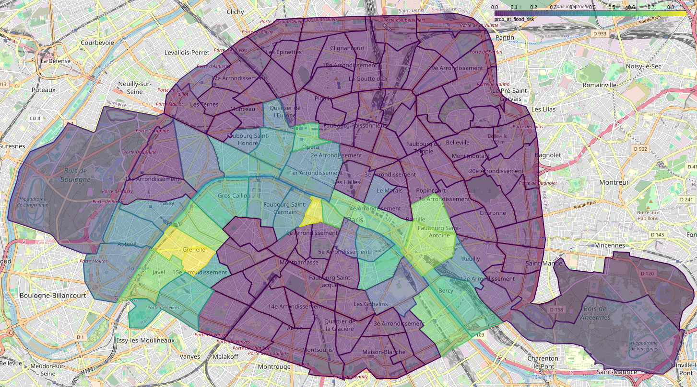
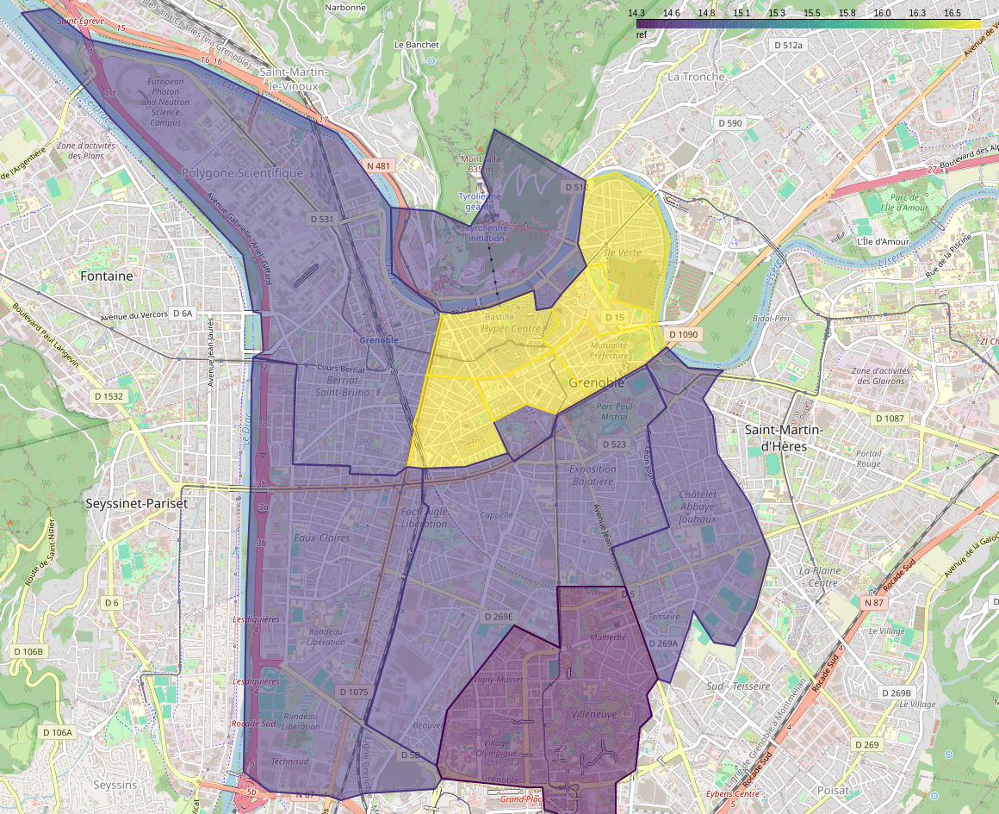

# climate-risks-france
This repository contains the code and data for my RAship work in the French climate risk project.

# TODO: SPLIT BETWEEN PARIS AND GRENOBLE

## Index
- [Paris](#paris)
  - [Geographic Units](#geographic-units-1)
  - [Heat Stress](#heat-stress)
  - [Rent Control](#rent-control-1)
  - [Flood Risk](#flood-risk)
- [Grenoble](#grenoble)
  - [Geographic Units](#geographic-units-2)
  - [Rent Control](#rent-control-2)

## Paris

### Geographic Units
All analyses for Paris are carried out at three geographic levels. From larger to smaller: _Code Postal_, _Conseil de Quartier_, and _SeLoger Quartier_. In this section you will find how the (multi)polygons for these geographic units are calculated. Note: I use the terms polygon, geoshape, shape and geometry indistinctively.

#### Data Sources
- The polygons for the low-quality _SeLoger Quartiers_ are taken from the [SeLoger API](https://www.seloger.com/search-mfe-bff/places).
- The polygons for the _SeLoger Quartiers_ are taken directly from the [SeLoger website, prix de l'immo section](https://www.seloger.com/prix-de-l-immo/vente/pays/france.htm#?BD=Head_AC_PrixImm_8&m=homepage_pricemap_quickaction_pricemap).
- The polygons for the _Conseils de Quartier_ can be found at [data.gouv.fr](https://www.data.gouv.fr/fr/datasets/les-conseils-de-quartier-par-arrondissement-prs/).
- The polygons for the _IRIS_ (Ilots Regroupés pour l'Information Statistique) are retrieved from the [géoservices webpage](https://geoservices.ign.fr/irisge).
- The crosswalk between _IRIS_ and _Commune_ is from the [INSEE webpage](https://www.insee.fr/fr/information/7708995#).
- Finally, the crosswalk between _Commune_ and _Code Postal_ can be found directly at [La Poste](https://datanova.laposte.fr/datasets/laposte-hexasmal).

#### Code
Each _.py_ file does one thing, and is named accordingly. If you have doubts about how something was done, which is not explained here, you can read the code: I tried to add helpful comments.
- _seloger_quartiers_low_quality_geoshapes.py_: Downloads the low quality _SeLoger Quartier_ polygons, along with their identifiers. Generates _seloger_quartiers_low_quality_geoshapes.geojson_
- _seloger_quartiers_geoshapes.py_: Downloads the low quality _SeLoger Quartier_ polygons, then filters and corrects them so that they match the low-quality ones, which are the ones that match by name and postal code the information shown in every ad. Generates _seloger_quartiers_geoshapes.geojson_
- _conseils_de_quartier_geoshapes.py_: Fetches the _Conseils de Quartier_ polygons. Generates _conseils_de_quartier_geoshapes.geojson_
- _codes_postaux_geoshapes.py_: Calculates the geoshapes of the _Codes Postaux_ based on the _IRIS_ and _Commune_ information. Generates _codes_postaux_geoshapes.geojson_

#### How It Is Done
##### Low-Quality _SeLoger Quartiers_
Simple download. _Low-quality_ means that the polygons are very roughly defined, with too little points.

##### _SeLoger Quartiers_
The polygons are harvested by reading the API calls that the front-end makes when you move around the prix-de-l'immo map at a _Quartier_ level, and stored as a _txt_ file. The problem is, some _SeLoger_ quartiers do not have a unique name, and they can only be told apart based on the postal code. But that information is not in the API response, so the best way is to match them with the low-quality ones, which do contain the name and postal code, and that also match the information present in the advertisements.
In order to do that, some inconsistencies between the two sets of polygons have to be corrected; and then they are matched based on name, when the name is unique, and on geographic proximity, when it is not.
NOTE: _SeLoger Quartiers_ are uniquely identified by name **AND** postal code!

##### _Conseils de Quartier_
Simple download.

##### _Codes Postaux_
Quite challenging, since there not seems to exist any repository with the polygon areas of the _Codes Postaux_ (see [this post](https://www.r-bloggers.com/2024/11/codes-postaux/) and [this article](https://vivreparis.fr/pourquoi-le-16e-arrondissement-possede-t-il-deux-codes-postaux/) for some insights). What we do, as a best-possible approach, is to try to map _Communes_ to _Codes Postaux_, stemming from the realisation that in most cases, either they map one-to-one, or a _Code Postal_ encompasses __exactly__ many _Communes_. To generate the polygons at the _Commune_, we start from the _IRIS_ polygons, and just melt together the polygons at the _Commune_ level. This is possible because _IRIS_ are an exact subdivision of _Communes_. Now comes the crucial step: 
- If there is a one-to-one mapping between _Commune_ and _Code Postal_, the polygon of the _Code Postal_ is set to be the one of the _Commune_.
- If a _Code Postal_ contains __exactly__ multiple _Communes_, the polygon of the _Code Postal_ is the result of melting together the polygons of the _Communes_.
- If a _Commune_ contains __exactly__ multiple _Codes Postaux_ (happens in around 8 cases), all of the _Codes Postaux_ get assigned the polygon of the _Commune_.
- Finally, some _Codes Postaux_ contain multiple _Communes_ (happens in 3 cases), which in turn contain multiple _Codes Postaux_. Here, the polygon of the _Code Postal_ will be the melted union of the polygons of the _Communes_ where the _Code Postal_ is present. For instance: the _Code Posal_ 95710 corresponds to the _Communes_ 95101, 95150, and 95011, but inside the _Commune_ 95011 there are two _Codes Postaux_: 95710 and 95420. In that case, the _Code Postal_ 95710 gets assigned the melted polygons of 95101, 95150, and 95011; and the _Code Postal_ 95420 gets assigned the polygon of 95011. As a result, the polygons of both _Codes Postaux_ will partly overlap.

### Heat Stress
The objective of this section is being able to tell how vulnerable a housing unit in Paris (or Île-de-France) is to heat and heat waves. This is done by calculating the average vulnerability at the _Code Postal_ (for Île-de-France) and at the _Conseil de Quartier_ and _SeLoger Quartier_ (city of Paris) levels.

#### Data Sources
The data containing heat stress values can be found at the webpage from [L'Insitut Paris Region](https://data-iau-idf.opendata.arcgis.com/datasets/iau-idf::ilots-de-chaleur-urbains-icu-classification-des-imu-en-zone-climatique-locale-lcz-al%C3%A9as-et-vuln%C3%A9rabilit%C3%A9s-%C3%A0-la-chaleur-de-jour-et-de-nuit-en-%C3%AEle-de-france/about). The heat stress metrics are given at the _IMU_ (Ilot Morphologic Urbain) level (can be visualized [here](https://data-iau-idf.opendata.arcgis.com/datasets/iau-idf::ilots-de-chaleur-urbains-icu-classification-des-imu-en-zone-climatique-locale-lcz-al%C3%A9as-et-vuln%C3%A9rabilit%C3%A9s-%C3%A0-la-chaleur-de-jour-et-de-nuit-en-%C3%AEle-de-france/explore), which roughly corresponds to a polygon the size of a building or group of buildings.

#### Code
Each _.py_ file does one thing, and is named accordingly. If you have doubts about how something was done, which is not explained here, you can read the code: I tried to add helpful comments.
- _heat_stress_geoshapes.py_: Downloads the dataset mentioned in the [Data Sources](#data-sources) Section above. Generates _heat_stress_geoshapes.zip_
- _seloger_quartiers_heat_stress.py_: Calculates the average heat stress at a _SeLoger Quartier_ level. Generates _seloger_quartiers_heat_stress.csv_
- _conseils_de_quartier_heat_stress.py_: Calculates the average heat stress at a _Conseil de Quartier_ level. Generates _conseils_de_quartier_heat_stress.csv_
- _codes_postaux_heat_stress.py_: Calculates the average heat stress at a _Code Postal_ level. Generates  _codes_postaux_heat_stress.csv_

#### Spatial Merges
Merges are simply done by calculating the ratio of the area of the intersection between any _IMU_ and any geographic unit (at the aforementioned three levels), with respect to the area of the geographic unit.

#### Averaging
Given a set of _IMUs_ $IMU_1, IMU_2, ..., IMU_N$ with corresponding heat stress values $x_1, x_2, ..., x_N$, the weighted average of $x$ for a polygon $P$ is defined as\
  $$\hat{x} = \frac{\sum_{i=1}^{N}|IMU_i \cap P|x_i}{\sum_{i=1}^{N}|IMU_i \cap P|}$$\
In words, the weight given to $x_i$ is proportional to the area of the intersection between $IMU_i$ and the polygon $P$.

#### Variables
The interpretation of the heat stress variables can be found [here](https://www.institutparisregion.fr/fileadmin/DataStorage/IauEtVous/CartesEtDonnees/cartesetdonnees/opendata/MetaPDF/ICU_LCZ_Alea_Vuln_Champs_2022.pdf). We mainly use the following two:
- _vulnJ_note_: The vulnerability index to UHI during the day. Ranges from 1 (very low vulnerability) to 8 (very high vulnerability). Individual _IMUs_ have an integer value, the average is a real value.
- _vulnN_note_: Idem, but during the night.

#### Results
The resulting files are _seloger_quartiers_heat_stress.csv_, _conseils_de_quartier_heat_stress.csv_ and _codes_postaux_heat_stress.csv_. A quick visualisation shows that central areas in Paris have a higher vulnerability than the periphery; and that the vulnerability is reduced by the presence of parks and green areas.

### Rent Control
The objective of this section is matching the rent control data published by the [DRIHL](http://www.referenceloyer.drihl.ile-de-france.developpement-durable.gouv.fr/paris/) with the spatial units used: _SeLoger Quartier_,  _Code Postal_ and _Conseil de Quartier_.

#### Data Sources
The datasets containing the rent control data and polygons are directly extracted from the [DRIHL webpage](http://www.referenceloyer.drihl.ile-de-france.developpement-durable.gouv.fr/paris/). An inspection of the webpage reveals that the polygons and data are fetched by API calls that request _.kml_ files from the same website. For the rest of the exercise filter for the most recent rent control limits, in place from 2024-07-01 to 2025-06-30, and keep only data for Paris city.

#### Code
Each _.py_ file does one thing, and is named accordingly. If you have doubts about how something was done, which is not explained here, you can read the code: I tried to add helpful comments.
- _rent_control_geoshapes.py_: Downloads the dataset mentioned in the [Data Sources](#data-sources-1) Section above.
- _seloger_quartiers_rent_control.py_: Calculates the average rent control prices at a _SeLoger Quartier_ level. Generates _seloger_quartiers_rent_control.csv_, as well as _seloger_quartiers_zone_overlap.csv_
- _conseils_de_quartier_rent_control.py_: Calculates the average rent control prices at a _Conseil de Quartier_ level. Generates _conseils_de_quartier_rent_control.csv_, as well as _conseils_de_quartier_zone_overlap.csv_
- _codes_postaux_rent_control.py_: Calculates the average rent control prices at a _Code Postal_ level. Generates  _codes_postaux_rent_control.csv_, as well as _codes_postaux_zone_overlap.csv_

#### Spatial Merges
The rent control area units are the 80 _Quartiers Administratifs_ (see the [official map](https://opendata.paris.fr/explore/dataset/quartier_paris/map/?disjunctive.c_ar&sort=c_qu&location=12,48.88786,2.35176&basemap=jawg.streets) from the Paris City Council), a subdivision of _Grand Quartiers_. The _Quartiers Administratifs_ are joined in 14 _Zones_ that share the same rent control levels. _Quartiers Administratifs_ in a same _Zone_ are not necessarily contiguous. 

##### _Zone_ - _Conseil de Quartier_
For around 70% of the 114 _Conseils de Quartier_, 90% of the area of the _Conseil de Quartier_ is inside a single _Zone_. For all but one, more than 50% of its area is inside a single _Zone_. The merge is relatively simple, since we have the polygons of both of them. Simply calculate, for each _Conseil de Quartier_, with how many _Zones_ there is overlap, and do the average (see the [Averaging](#averaging-1) Section).

##### _Zone_ - _SeLoger Quartier_
Almost as above, since we have 130 _Seloger Quartiers_, which are slightly smaller than a _Conseil de Quartier_.

##### _Zone_ - _Code Postal_
Out of the 21 _Codes Postaux_ of Paris, only 2 have more than 90% of their area inside a single _Zone_, so the match quality is lower than with _Conseils de Quartier_. Similarly, we calculate overlaps and average.

NOTE: This analysis could be expanded to Plaine Commune and Est Ensemble, since we have both the rent control and the postal code data for them, too.

#### Averaging
Given a set of _Zones_ $Zone_1, Zone_2, ..., Zone_N$ with corresponding rent control values $x_1, x_2, ..., x_N$, the weighted average of $x$ for a polygon $P$ is defined as\
  $$\hat{x} = \frac{\sum_{i=1}^{N}|Zone_i \cap P|x_i}{\sum_{i=1}^{N}|Zone_i \cap P|}$$\
In words, the weight given to $x_i$ is proportional to the area of the intersection between $Zone_i$ and the polygon $P$.

#### Variables
The datasets _*_rent_control.csv_ have 4 categorical variables and 3 numeric variables.

The categorical variables are:
- _rooms_: number of rooms of the property: 1, 2, 3, or 4. 4 corresponds to 4 or more;
- _epoque_: property construction epoque. Values are inf1946 (before 1946), 1946-1970, 1971-1990, sup1990 (after 1990);
- _furnished_: meuble or non-meuble.

The numeric variables, all of them expressed as €/m², are:
- _ref_: benchmark rent, as calculated by the _Observatoire des loyers de l'agglomération parisienne_ (OLAP).
- _refmaj_: higher benchmark rent (20% over the benchmark rent). Renting a property with a higher price is punishable by law.
- _refmin_: lower benchmark rent (30% under the benchmark rent).

#### Results
The resulting files are _seloger_quartiers_rent_control.csv_, _conseils_de_quartier_rent_control.csv_ and _codes_postaux_rent_control.csv_. Additionally, the files _seloger_quartiers_rent_control.csv_, _conseils_de_quartier_zone_overlap.csv_ and _codes_postaux_zone_overlap.csv_ show the % of area of each unit inside the _Zone_ with highest overlap.

A quick visualization shows that central areas in Paris have a higher reference rent than the periphery.

### Flood Risk
In this section we calculate the risk of river flood at the _Code Postal_ (for Île-de-France) and at the _Conseil de Quartier_ and _SeLoger Quartier_ (city of Paris) levels. Roughly, the idea consists on calculating the intersection between the areas with high risk of flood in any of the scenarios inside of the flood risk dataset (see the [following](#data-sources-3) section) with the geographic units. Before calculating the intersection however, the areas that are always underwater, such as rivers, are removed from the geographic units, because these areas are not labelled as having flood risk in the flood risk dataset.

#### Data Sources
- The flood risk areas are extracted from [this map from the Insitut Paris Region](https://www.arcgis.com/apps/mapviewer/index.html?url=https://geoweb.iau-idf.fr/server/rest/services/RISQUES/cartoviz_zini_simplifiees/MapServer&source=sd).
- The areas that are always underwater are also taken from an [Institut Paris Region map](https://www.arcgis.com/apps/mapviewer/index.html?url=https://geoweb.iau-idf.fr/server/rest/services/RISQUES/Cartoviz_zip/FeatureServer&source=sd).

#### Code
Each _.py_ file does one thing, and is named accordingly. If you have doubts about how something was done, which is not explained here, you can read the code: I tried to add helpful comments.
- _flood_risk_geoshapes.py_: Downloads the flood risk dataset mentioned in the [Data Sources](#data-sources-3) Section above. Generates _flood_risk_geoshapes.geojson_
- _always_underwater_geoshapes.py_: Downloads the always underwater dataset mentioned in the [Data Sources](#data-sources-3) Section above. Generates _always_underwater_geoshapes/all_layers.geojson_
- _seloger_quartiers_flood_risk.py_: Calculates the proportion of each _SeLoger Quartier_ (excluding areas always underwater) that has high risk of flood. Generates _seloger_quartiers_flood_risk.csv_
- _conseils_de_quartier_flood_risk.py_: Calculates the proportion of each _Conseil de Quartier_ (excluding areas always underwater) that has high risk of flood. Generates _conseil_de_quartiers_flood_risk.csv_
- _codes_postaux_flood_risk.py_: Calculates the proportion of each _Code Postal_ (excluding areas always underwater) that has high risk of flood. Generates _codes_postaux_flood_risk.csv_

#### Proportion Calculation
The proportion of area with flood risk is calculated as the ratio of the area of the geographic unit (at the aforementioned three levels) minus those parts which are always underwater, that intersects with the areas with flood risk, with respect to the area of the geographic unit minus the areas always underwater. Let $P$ be the shape of a geographic unit, $A$ be the shape of all areas always underwater, and $R$ be the shape of all areas with high flood risk. The the proportion of flood risk area is $prop$ is defined as\
  $$prop = \frac{|(P\setminus A)\cap R|}{|P\setminus A|}$$

#### Variables
The only variable is _prop_at_flood_risk_, a real number between 0 and 1.

#### Results
The resulting files are _seloger_quartiers_flood_risk.csv_, _conseils_de_quartier_flood_risk.csv_ and _codes_postaux_flood_risk.csv_. A quick visualization shows that areas in Paris close to the Seine have a higher flood risk.

## Grenoble

### Geographic Units
All analyses for Grenoble are carried out at two geographic levels. From larger to smaller: _Code Postal_, and _SeLoger Quartier_. In this section you will find how the (multi)polygons for these geographic units are calculated. Note: I use the terms polygon, geoshape, shape and geometry indistinctively.

#### Data Sources
- The polygons for the low-quality _SeLoger Quartiers_ are taken from the [SeLoger API](https://www.seloger.com/search-mfe-bff/places).
- The polygons for the _SeLoger Quartiers_ are taken directly from the [SeLoger website, prix de l'immo section](https://www.seloger.com/prix-de-l-immo/vente/pays/france.htm#?BD=Head_AC_PrixImm_8&m=homepage_pricemap_quickaction_pricemap).
- The polygons for the _IRIS_ (Ilots Regroupés pour l'Information Statistique) are retrieved from the [géoservices webpage](https://geoservices.ign.fr/irisge).
- The crosswalk between _IRIS_ and _Commune_ is from the [INSEE webpage](https://www.insee.fr/fr/information/7708995#).
- Finally, the crosswalk between _Commune_ and _Code Postal_ can be found directly at [La Poste](https://datanova.laposte.fr/datasets/laposte-hexasmal).

#### Code
Each _.py_ file does one thing, and is named accordingly. If you have doubts about how something was done, which is not explained here, you can read the code: I tried to add helpful comments.
- _seloger_quartiers_low_quality_geoshapes.py_: Downloads the low quality _SeLoger Quartier_ polygons, along with their identifiers. Generates _seloger_quartiers_low_quality_geoshapes.geojson_
- _seloger_quartiers_geoshapes.py_: Downloads the low quality _SeLoger Quartier_ polygons, then filters and corrects them so that they match the low-quality ones, which are the ones that match by name and postal code the information shown in every ad. Generates _seloger_quartiers_geoshapes.geojson_
- _codes_postaux_geoshapes.py_: Calculates the geoshapes of the _Codes Postaux_ based on the _IRIS_ and _Commune_ information. Generates _codes_postaux_geoshapes.geojson_

#### How It Is Done
##### Low-Quality _SeLoger Quartiers_
Simple download. _Low-quality_ means that the polygons are very roughly defined, with too little points.

##### _SeLoger Quartiers_
The polygons are harvested by reading the API calls that the front-end makes when you move around the prix-de-l'immo map at a _Quartier_ level, and stored as a _txt_ file. The problem is, some _SeLoger_ quartiers do not have a unique name, and they can only be told apart based on the postal code. But that information is not in the API response, so the best way is to match them with the low-quality ones, which do contain the name and postal code, and that also match the information present in the advertisements.
In order to do that, some inconsistencies between the two sets of polygons have to be corrected; and then they are matched based on name.

##### _Codes Postaux_
Quite challenging, since there not seems to exist any repository with the polygon areas of the _Codes Postaux_ (see [this post](https://www.r-bloggers.com/2024/11/codes-postaux/) and [this article](https://vivreparis.fr/pourquoi-le-16e-arrondissement-possede-t-il-deux-codes-postaux/) for some insights). What we do, as a best-possible approach, is to try to map _Communes_ to _Codes Postaux_, stemming from the realisation that in most cases, either they map one-to-one, or a _Code Postal_ encompasses __exactly__ many _Communes_. To generate the polygons at the _Commune_, we start from the _IRIS_ polygons, and just melt together the polygons at the _Commune_ level. This is possible because _IRIS_ are an exact subdivision of _Communes_. Now comes the crucial step: 
- If there is a one-to-one mapping between _Commune_ and _Code Postal_, the polygon of the _Code Postal_ is set to be the one of the _Commune_.
- If a _Code Postal_ contains __exactly__ multiple _Communes_, the polygon of the _Code Postal_ is the result of melting together the polygons of the _Communes_.
- If a _Commune_ contains __exactly__ multiple _Codes Postaux_, all of the _Codes Postaux_ get assigned the polygon of the _Commune_.
- Finally, some _Codes Postaux_ contain multiple _Communes_, which in turn contain multiple _Codes Postaux_. Here, the polygon of the _Code Postal_ will be the melted union of the polygons of the _Communes_ where the _Code Postal_ is present.

### Rent Control
The objective of this section is matching the rent control data published by the [ISERE](https://www.isere.gouv.fr/contenu/telechargement/76673/598917/file/3_Tableau_loyers%20de%20r%C3%A9f%C3%A9rence_ANIL.pdf) with the spatial units used: _SeLoger Quartier_ and _Code Postal_.

#### Data Sources
For this section we use the rent control set by the [ISERE](https://www.isere.gouv.fr/contenu/telechargement/76673/598917/file/3_Tableau_loyers%20de%20r%C3%A9f%C3%A9rence_ANIL.pdf) and the shapes published by the [Observatories des Loyers](https://www.observatoires-des-loyers.org/datagouv/2023/Base_OP_2023_L3800.zip)

#### Code
Each _.py_ file does one thing, and is named accordingly. If you have doubts about how something was done, which is not explained here, you can read the code: I tried to add helpful comments.
- _rent_control_zones_geoshapes.py_: Downloads and merges the datasets mentioned in the [Data Sources](#data-sources-5) Section above.
- _seloger_quartiers_rent_control.py_: Calculates the averaÉpoque de
constructionge rent control prices at a _SeLoger Quartier_ level. Generates _seloger_quartiers_rent_control.csv_, as well as _seloger_quartiers_zone_overlap.csv_
- _codes_postaux_rent_control.py_: Calculates the average rent control prices at a _Code Postal_ level. Generates  _codes_postaux_rent_control.csv_, as well as _codes_postaux_zone_overlap.csv_.

#### Spatial Merges
Grenoble and its periphery is divided in 6 zones (Zone 1, 2, 3, A, B and C), of which only 3 (1, 2 and A) are subject to rent controls.

##### _Zone_ - _SeLoger Quartier_
Almost as above, since we have 130 _Seloger Quartiers_, which are slightly smaller than a _Conseil de Quartier_.

##### _Zone_ - _Code Postal_
The .

#### Averaging
Given a set of _Zones_ $Zone_1, Zone_2, ..., Zone_N$ with corresponding rent control values $x_1, x_2, ..., x_N$, the weighted average of $x$ for a polygon $P$ is defined as\
  $$\hat{x} = \frac{\sum_{i=1}^{N}|Zone_i \cap P|x_i}{\sum_{i=1}^{N}|Zone_i \cap P|}$$\
In words, the weight given to $x_i$ is proportional to the area of the intersection between $Zone_i$ and the polygon $P$. Note: the weights are normalized to 1; this means that even if a polygon has only a tiny subregion affected with rent control, that value is extrapolated to the whole polygon -- even if the majority of the polygon does not have rent control! Polygons where the sum of the weights is zero (not overlap with rent control zones) are kept out of the produced files.

#### Variables
The datasets _*_rent_control.csv_ have ? categorical variables and ??? numeric variables.

The categorical variables are:
- _rooms_: number of rooms of the property: 1, 2, 3, or 4. 4 corresponds to 4 or more;
- _epoque_: property construction epoque. Values are inf1946 (before 1946), 1946-1970, 1971-1990, sup1990 (after 1990);
- _furnished_: meuble or non-meuble.

The numeric variables, expressed as €/m² (except _maj_, which is a coefficient), are:
- _ref_: benchmark rent, as calculated by the _Observatoire des loyers de l'agglomération parisienne_ (OLAP).
- _refmaj_: higher benchmark rent (20% over the benchmark rent). Renting a property with a higher price is punishable by law.
- _refmin_: lower benchmark rent (30% under the benchmark rent).
- _maj_: 

#### Results
The resulting files are _seloger_quartiers_rent_control.csv_ and _codes_postaux_rent_control.csv_. 

A quick visualization shows that central areas in Grenoble have a higher reference rent than the periphery.
